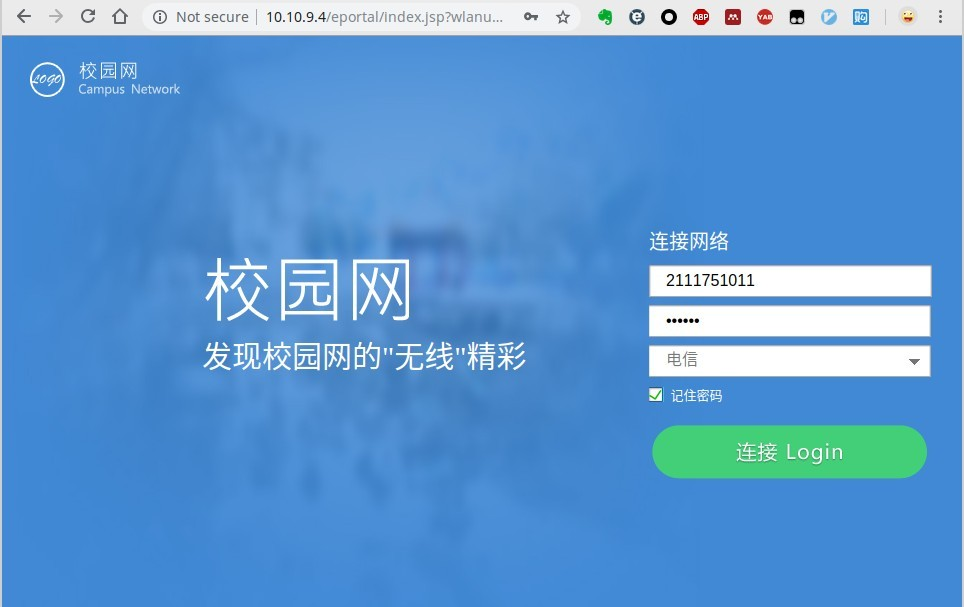
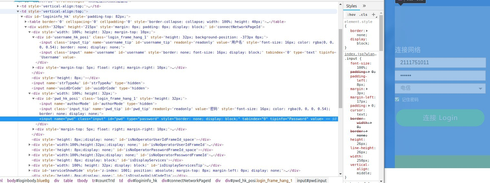

# 本程序是为了防止校园网断网而编写

## 使用说明
1. 本程序基于python2.7，selennium，requests
2. 安装好selenium后需要安装浏览器对应版本的WebDriver,例如我用的是Chrome，就需要使用[ChromeDriver](http://chromedriver.storage.googleapis.com/index.html)
3. 程序思路其实就是一个模拟点击的过程，使用浏览器开发者模式查看校园网登录界面相应的标签就行。
## 校园网登录界面

